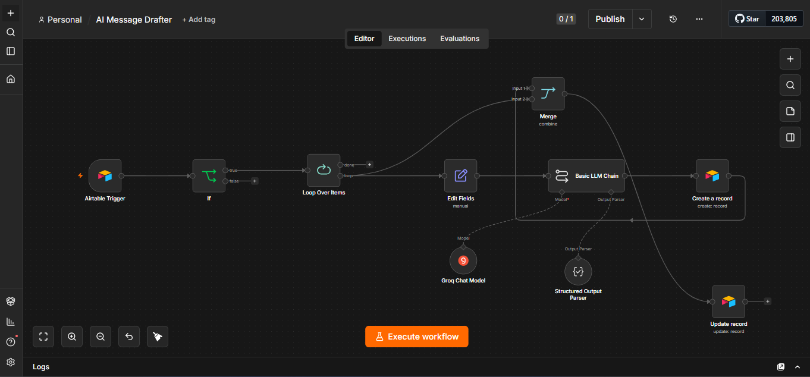

# AI Message Drafter

An AI-powered outbound messaging system that turns qualified prospect data into personalized, multi-channel sales messages using n8n, Airtable, and LLM orchestration.

## Overview

The AI Message Drafter automates one of the repetitive parts of outbound sales: turning prospect information into relevant, personalized messaging.

The workflow monitors qualified prospects, checks whether they meet the messaging criteria, gathers relevant context, generates channel-specific messages with an LLM, and stores the results for review and follow-up.

## The Problem

Personalized outbound messaging becomes difficult to manage as the number of prospects increases.

Sales teams need to:

- Review prospect information
- Decide which prospects are worth contacting
- Personalize messages
- Adapt messaging to different channels
- Keep track of generated outreach
- Avoid contacting the same prospect repeatedly

These steps create repetitive manual work and increase the chance of inconsistent messaging.

## The Solution

This workflow turns the process into an automated pipeline:

**Qualified Prospect → Qualification Check → Context Retrieval → AI Message Generation → Review → CRM/Database Update**

A prospect must meet the defined qualification threshold before the AI generates outreach.

## Workflow Architecture



## Core Workflow

### 1. Qualification

The workflow evaluates the prospect's qualification score.

Only prospects meeting the configured **ASSET Score ≥ 4** threshold continue to the messaging stage.

### 2. Duplicate Prevention

Before generating new outreach, the workflow checks whether messaging has already been created for the prospect.

This prevents unnecessary duplicate outreach.

### 3. Context Retrieval

Relevant prospect and company information is retrieved from the existing data source.

This context is passed to the AI generation stage.

### 4. AI Message Generation

The LLM generates personalized outreach based on the available prospect information and defined messaging rules.

The system generates messaging for multiple channels, including:

- LinkedIn connection
- LinkedIn follow-up
- X
- Telegram

### 5. Review & Tracking

Generated messages are written back to the data layer with a review/status state so they can be reviewed before being used for outreach.

## Example

### Input

```json
{
  "first_name": "Sarah",
  "last_name": "Chen",
  "title": "VP of Engineering",
  "company": "Acme AI",
  "company_size": "201-500",
  "industry": "Developer Tools"
}

```
## Generated Output

```json
{
  "prospect_name": "Sarah Chen",
  "company": "Acme AI",
  "segment": "Marketplace",
  "credibility_rung": "STR8FIRE",
  "linkedin_connection": "Hi Sarah, noticed Acme AI is expanding its engineering organization. Curious how you're thinking about developer productivity as the team grows.",
  "linkedin_followup": "Hi Sarah, thanks for connecting. I noticed Acme AI is growing its engineering organization. Teams at this stage often run into challenges around visibility and coordination across engineering. Would you be open to a quick conversation?",
  "x_message": "Noticed Acme AI is scaling its engineering team. That often creates visibility challenges across teams. Curious how you're handling that today?",
  "telegram_message": "Hi Sarah, noticed Acme AI is expanding its engineering organization. As teams grow, visibility across engineering can become harder to maintain. Curious how you're approaching that today?",
  "review_status": "Pending Review"
}

```
## Key Features
AI-powered personalized messaging
Qualification-based automation
Duplicate outreach prevention
Multi-channel message generation
Structured AI output
Human review before outreach
Airtable integration
n8n workflow orchestration
Reusable prompt architecture

## Technology Stack

### AI

- OpenAI
- Prompt Engineering
- Structured LLM Outputs

### Automation

- n8n
- Webhooks
- Conditional Logic

### Data

- Airtable
- JSON
- REST APIs

## Repository Structure

ai-message-drafter/
│
├── README.md
│
├── docs/
│   └── workflow-overview.png
│
├── workflow/
│   └── message-drafter-workflow.json
│
├── prompts/
│   └── system-prompt.md
│
└── examples/
    ├── sample-lead.json
    └── generated-message.json


